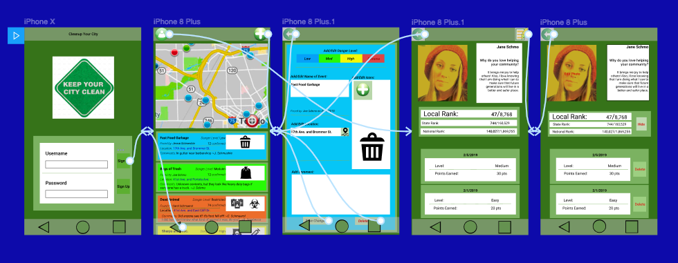
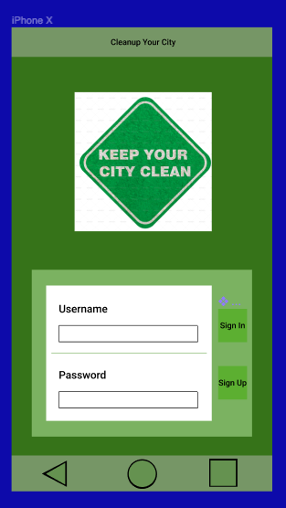
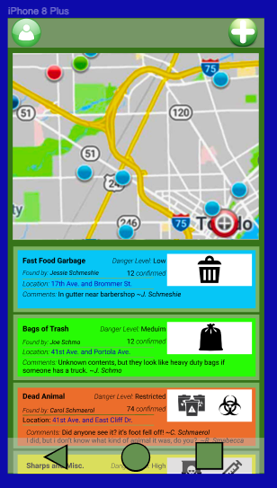
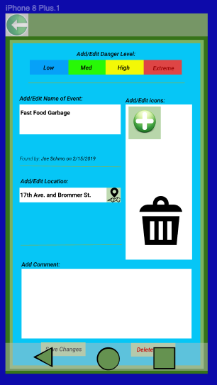
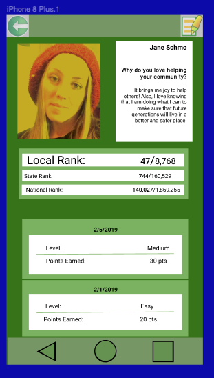
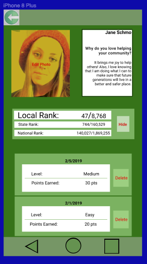

# CleanupYourCity

## Table of Contents
1. [Overview](#Overview)
1. [Product Spec](#Product-Spec)
1. [Wireframes](#Wireframes)
2. [Schema](#Schema)

## Overview

### Description
This application allows users to be involved in keeping their city clean!
- A user can choose a location where they see some garbage or (like on 
the side of a road), give the location a danger rating from 1-4, and choose 
an icon(s) that show the type(s) of garbage present.
- A user can also see the locations that have already been marked as
having garbage, and can choose to adopt that garbage for points. Before 
choosing, they can also see the danger level and the potential contents of
the garbage.
- If for any reason the user can't adopt some particular garbage, they can 
still decide to withdraw their decision.

### App Evaluation
[Evaluation of your app across the following attributes]
- **Category:**
- **Mobile:**
- **Story:**
- **Market:**
- **Habit:**
- **Scope:**

## Product Spec

### 1. User Stories (Required and Optional)
**Required Stories**

* [X] User can register and login
* [] User can view garbage in their area
* [] User can add location to clean
* [] User can view profile info
* [] User can edit photo/profile
* [] User can adopt garbage


**Optional Stories**

* [] User can view leaderboard
* [] User can up/down vote events
* [] User can leave comments on events


### 2. Screen Archetypes
Login Screen
* User can login; user can register

Stream / Maps
* User can view garbage in their area
Creation
* User can add location to clean, and details 
Detail
* User can view garbage details
Profile
* User can view profile and history
* Leaderboard *(Optional)* 


### 3. Navigation
**Tab Navigation** (Tab to Screen)

* Profile Tab Button from Stream/Maps to Profile View
* Add garbage Tab Button from Stream/Maps to Creation View
* Back button from Profile View to Stream/Maps View
* Back button from Creation View to Stream/Maps View
* Back button from Detail View to Stream/Maps View

**Optional Tab Navigation**
* Leaderboard Tab Button from Profile View to Leaderboard View

**Flow Navigation** (Screen to Screen)

* Stream/Maps View: Tap Trash to View Details View


## Wireframes


### [BONUS] Digital Wireframes & Mockups







### [BONUS] Interactive Prototype


## Schema 
[This section will be completed in Unit 9]

### Models
#### Event
   | Property    | Type     | Description |
   | ------------| -------- | ------------|
   | eventNumber | Number   | unique id for the event post (default field) |
   | username    | Pointer to User | event author |
   | trashType   | String/Image     | emoji of trash that is at the event |
   | location    | Number   | the location the trash is at |
   | description | Number   | description of the trash at the event |
   | severity    | Number   | the severity of the trash at the event rated from 1-4 |
   | date        | DateTime | date when event should be cleaned up      |
   | picture     | Image    | an image of the trash at the location  |
   | comments    | String Array    | comments the users can post on the events  |
#### User
   | Property    | Type     | Description |
   | ------------| -------- | ------------|
   | username    | String   | unique string for the user |
   | picture     | Image    | profile image for the user |
   | history     | Array of event pointers | history of events already completed by the user |

### Networking
#### List of network requests by screen
   - Main Screen
      - (Read/GET) Query all events where users are author
         ```swift
         let query = PFQuery(className:"Post")
         query.whereKey("author", equalTo: currentUser)
         query.order(byDescending: "createdAt")
         query.findObjectsInBackground { (posts: [PFObject]?, error: Error?) in
            if let error = error { 
               print(error.localizedDescription)
            } else if let posts = posts {
               print("Successfully retrieved \(posts.count) posts.")
           // TODO: Do something with posts...
            }
         }
         ```
      - (Create/POST) Create a new event
         - (Create/POST) Create map pin

      - (Delete) Delete existing event
      - (Create/POST) Optional: Upvote/Downvote

      
   - Create Post Screen
      - (Create/POST) Input event details
      - (Delete) Delete current event
      
   - Edit Post Screen
      - (Read/GET) Query information of event
      - (Create/POST) Edit event details
      - (Delete) Delete current event

   - Post Detail Screen
      - (Read/GET) Query all data from event
         Optional: Comments
         - (Create/POST) Create a new comment on a post
         - (Delete) Delete existing comment

   - Profile Screen
      - (Read/GET) Query logged in user object
      - (Update/PUT) Update user profile image and info field
      
   - Optional: Leaderboard
      - (Read/GET) Query all posts by ranking
